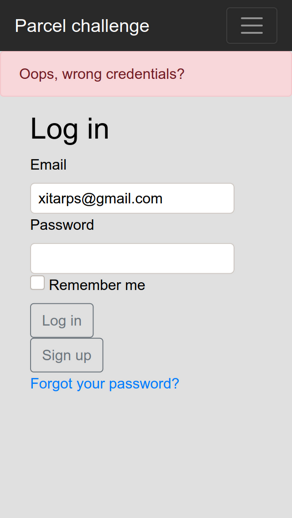

# Parcel challenge

## Informações:
Sistema de geração de crédio parcelado desenvolvido com o propósito de entregar projeto para processo seletivo em tempo restrito.

Esse projeto teve o intuito de sanar os requisitos estipulados como:

* Aplicação web, utilizando frameworks
* Cadastrar um solicitante(razão social, cnpj, endereço(s) e telefone(s));
* Criar uma solicitação de crédito(valor);
* Calcular prazo e taxa de juros.
* Gerar automaticamente as respectivas parcelas com intervalos regulares de um mês entre os vencimentos.

O Sistema se encontra em estágio inicial de desenvolvimento.

Algumas propostas futuras de desenvolvimento seriam:
* Limpar melhor o código
* Enxugar partes do código
* Implementar mais testes
* Possivel refatoração de front-end
* Admin poder alterar parcelas ou criar novas
* entre outros...

## Tecnologias envolvidas no projeto:
* Ruby
* Rails
* HTML
* CSS
* JavaScript
* BootStrap
* Rspec
* Rubocop
* FactoryBot
* SimpleCov
* Devise
* PostgreSQL
* Linux
* Github
* Heroku
* faraday

- Obs: Por fazer uso do heroku com hospedagem gratuita, algumas limitações podem ocorrer, como limitações com decimal.

## Sistema em ação(heroku):

https://parcel-challenge.herokuapp.com/requester_dashboard

## Screens:

